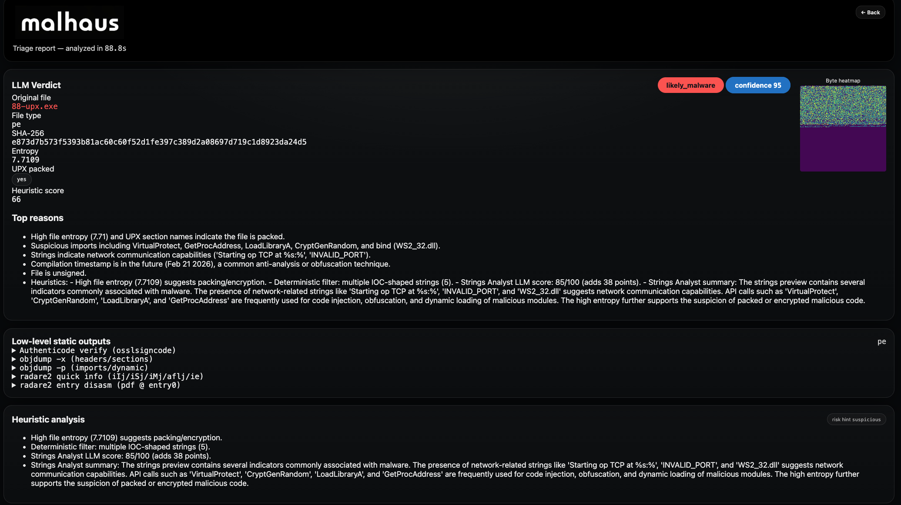
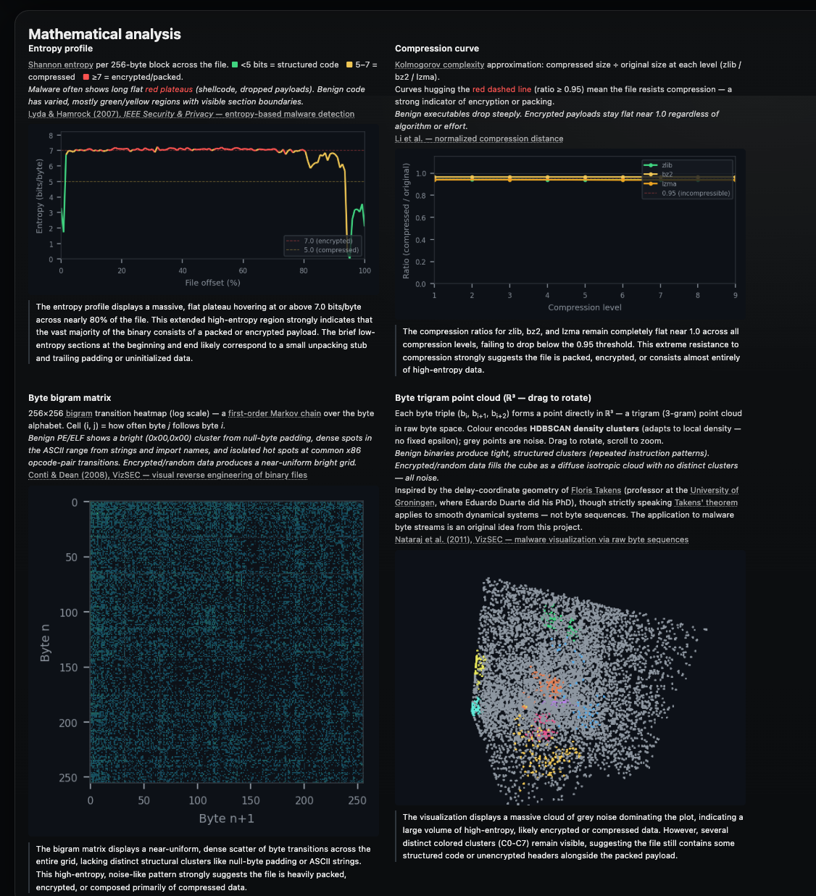

<p align="center">
  
</p>

Self-hosted **malware static triage platform** powered by LLMs.

Upload a suspicious file or paste a URL — malhaus runs it through a pipeline of static analysis tools (radare2, YARA, strings, objdump, oletools, floss, binwalk, exiftool, optional Ghidra…), feeds the results to an LLM of your choice, and returns a structured verdict with confidence score, key reasons, and full tool output.

**Live demo:** [https://grothendieck.ff2.nl](https://grothendieck.ff2.nl)



---

## Features

- PE, ELF, Office (OLE/OpenXML), PDF, PowerShell, shell script, JavaScript
- Supports **Gemini, OpenAI, Azure AI Foundry, Claude, DeepSeek**, and any OpenAI-compatible server (Ollama, vLLM, LM Studio)
- REST API with Bearer token authentication and per-key rate limiting
- MCP server — AI agents (Claude, Cursor, Continue…) can call `analyze` natively
- Mathematical analysis visualizations — entropy profile, compression curve, bigram matrix, and a 3D byte-trigram point cloud with HDBSCAN density clustering
- Optional Ghidra headless decompilation (PE/ELF)
- Result cache by SHA-256 — re-submitting the same file is instant
- Captcha-protected web UI; API bypasses captcha with a token

### Mathematical analysis

Every file is analysed through four independent visualizations derived purely from its byte sequence:

- **Entropy profile** — sliding-window [Shannon entropy](https://en.wikipedia.org/wiki/Entropy_(information_theory)) plotted across the file offset. Flat high-entropy regions indicate compression or encryption; structured dips reveal headers, overlays, or plaintext sections. See also [Lyda & Hamrock (2007), IEEE Security & Privacy — entropy-based malware detection](https://ieeexplore.ieee.org/document/4140989).
- **Compression curve** — the file is compressed at every level with zlib, bz2, and lzma. The resulting ratio curves distinguish truly random data (flat near 1.0) from structured or already-compressed content. Grounded in [Kolmogorov complexity](https://en.wikipedia.org/wiki/Kolmogorov_complexity).
- **Bigram matrix** — a 256×256 [bigram](https://en.wikipedia.org/wiki/Bigram) transition heatmap (log scale) — a [first-order Markov chain](https://en.wikipedia.org/wiki/Markov_chain) over bytes. Packed or encrypted files produce uniform noise; executables and documents leave recognisable diagonal and off-diagonal patterns that fingerprint the file format. See [Conti & Dean (2008), VizSEC — visual reverse engineering of binary files](https://www.semanticscholar.org/paper/Visual-Reverse-Engineering-of-Binary-and-Data-Files-Conti-Dean/854055131cb3f029ccf2ea2f7ce8aa675d5d8f6e).
- **Byte-trigram point cloud** *(experimental)* — every overlapping triple of bytes `(b[i], b[i+1], b[i+2])` is treated as a 3D coordinate. This is an experimental application of delay-coordinate embedding to malware byte streams, inspired by [Floris Takens](https://en.wikipedia.org/wiki/Floris_Takens) and [Takens' theorem](https://en.wikipedia.org/wiki/Takens%27s_theorem) — a theorem originally developed for reconstructing strange attractors in dynamical systems, not for file analysis. PCA reduces the cloud to 2D and HDBSCAN groups points into density clusters, each rendered in a distinct colour. The resulting geometry is visually suggestive of structural regions (null padding, code, strings, overlays) but has not been formally validated as a classifier. See also [Nataraj et al. (2011), VizSEC — malware visualization via raw byte sequences](https://dl.acm.org/doi/10.1145/2016904.2016908).

All four charts are interpreted by the LLM as part of the triage pipeline.



---

## Quick start — Docker (recommended)

```bash
# 1. Install Docker
curl -fsSL https://get.docker.com | sh
sudo usermod -aG docker $USER && newgrp docker

# 2. Clone
git clone https://github.com/toorandom/malhaus
cd malhaus

# 3. Configure
cp .env.example .env
# edit .env — set MALHAUS_SECRET_KEY and your LLM provider + key

# 4. Point nginx at your domain
sed -i 's/your-domain.com/yourdomain.com/g' nginx/nginx.conf

# 5a. Get a TLS certificate — public domain (Let's Encrypt)
sudo apt install -y certbot
sudo certbot certonly --standalone -d yourdomain.com

# 5b. OR — self-signed certificate for internal/air-gapped deployments
#     (browser will warn; add the cert to your internal CA trust store to silence it)

# Generate the certificate (valid 10 years, includes server IP and optional DNS name)
mkdir -p certs
openssl req -x509 -newkey rsa:4096 -sha256 -days 3650 -nodes \
  -keyout certs/privkey.pem -out certs/fullchain.pem \
  -subj "/CN=malhaus" \
  -addext "subjectAltName=IP:$(hostname -I | awk '{print $1}'),DNS:malhaus.internal"

# Point nginx to the self-signed certs instead of Let's Encrypt paths
sed -i 's|ssl_certificate .*|ssl_certificate     /etc/nginx/certs/fullchain.pem;|' nginx/nginx.conf
sed -i 's|ssl_certificate_key .*|ssl_certificate_key /etc/nginx/certs/privkey.pem;|' nginx/nginx.conf

# Mount the certs folder into the nginx container (replace the letsencrypt mount)
sed -i 's|- /etc/letsencrypt:/etc/letsencrypt:ro|- ./certs:/etc/nginx/certs:ro|' docker-compose.yml

# 6. Build and start
docker compose up -d --build
docker compose logs -f
```

The app is now reachable at `https://yourdomain.com` (or `https://<server-ip>` for self-signed).

See [START.md](START.md) for the full deployment guide including updates, backups, moving to another machine, and troubleshooting.

---

## Quick start — bare metal / development

```bash
sudo ./install_system.sh       # apt packages: radare2, yara, ssdeep, oletools, etc.
sudo ./install_additional.sh   # osslsigncode, captcha/pillow dependencies
./install_python.sh            # creates .venv and installs Python packages

cp config.source.example config.source
nano config.source             # set MALHAUS_LLM_PROVIDER, MALHAUS_LLM_API_KEY, MALHAUS_SECRET_KEY

./run.sh                       # sources config.source and starts gunicorn on 127.0.0.1:8000
```

---

## LLM providers

Set `MALHAUS_LLM_PROVIDER` in `.env` (Docker) or `config.source` (bare metal):

| Provider | Value | Notes |
|----------|-------|-------|
| Google Gemini | `gemini` | Default. `gemini-2.5-flash` / `gemini-2.5-pro` |
| OpenAI | `openai` | `gpt-4o-mini` / `gpt-4o` |
| Azure AI Foundry | `azure` | Set `MALHAUS_LLM_ENDPOINT` to your Azure endpoint |
| Anthropic Claude | `claude` | `claude-haiku-4-5-20251001` / `claude-sonnet-4-6` |
| DeepSeek | `deepseek` | `deepseek-chat` |
| Any OpenAI-compatible | `openai` | Set `MALHAUS_LLM_ENDPOINT` (Ollama, vLLM, LM Studio…) |

See `.env.example` for full configuration examples.

---

## Ghidra integration (optional)

Ghidra headless decompilation adds a deeper static analysis pass for PE and ELF files — it decompiles functions, scores suspicious API combinations, and extracts embedded indicators (IPs, URLs, registry keys).

**Requires:** Ghidra 11+ installed on the **host** machine.

### Docker

1. Install Ghidra on the host (e.g. `/opt/ghidra`). Java 21 is already baked into the image.
2. The `docker-compose.yml` mounts `/opt/ghidra` from the host into the container automatically.
3. Add to `.env`:
   ```
   MALHAUS_GHIDRA_DIR=/opt/ghidra
   ```
4. Rebuild: `docker compose up -d --build`

### Bare metal

1. Install Ghidra and Java 21 (`sudo apt install openjdk-21-jdk-headless` on Ubuntu 24.04+).
2. Add to `config.source`:
   ```
   export MALHAUS_GHIDRA_DIR=/opt/ghidra
   export JAVA_HOME=/usr/lib/jvm/java-21-openjdk-amd64
   ```

### Enabling per analysis

- **Web UI:** check the **Use Ghidra** checkbox before submitting.
- **REST API:** pass `use_ghidra=1` as a form field:
  ```bash
  curl -X POST https://your-server/api/v1/upload \
    -H "X-API-Key: YOUR_KEY" \
    -F "file=@sample.exe" \
    -F "use_ghidra=1"
  ```

Ghidra analysis typically takes 1–3 minutes per file.

---

## API & MCP

All API responses are **JSON**. Submitting a file returns a `job_id` immediately; you poll `GET /api/v1/jobs/<job_id>` until done:

```json
{
  "status":          "done",
  "sha256":          "e3b0c442...",
  "report_url":      "/report/e3b0c442...",
  "verdict": {
    "risk_level":    "likely_malware",
    "confidence":    92,
    "file_type":     "PE32 executable"
  },
  "heuristic_score": 74,
  "top_reasons":     ["High entropy sections consistent with packing", "..."],
  "tools_used":      ["mandatory_authenticode_verify", "mandatory_objdump_pe_headers", "..."],
  "tool_outputs":    { "mandatory_authenticode_verify": { "stdout": "...", "error": null } }
}
```

Add `?include=images,takens2d` to also receive the entropy profile, compression curve, bigram matrix, and trigram point cloud as base64 PNGs with LLM interpretations.

Every web report also exposes its raw JSON at `GET /report/<sha256>/json` — no authentication needed. A **JSON ↗** link appears on every report page.

- [REST API reference](README-API.md) — full endpoint docs, all request/response formats, curl and Python examples
- [MCP server](README-MCP.md) — connect Claude Desktop, Cursor, Continue, or any MCP client
- [API key management](README-API-KEY-MGNT.md) — create, list, revoke keys
- [Adding a new analysis tool](README-CREATE-NEW-TOOL.md) — extend the pipeline

---

## License

MIT — Copyright (c) 2026 Eduardo Ruiz Duarte &lt;toorandom@gmail.com&gt;
